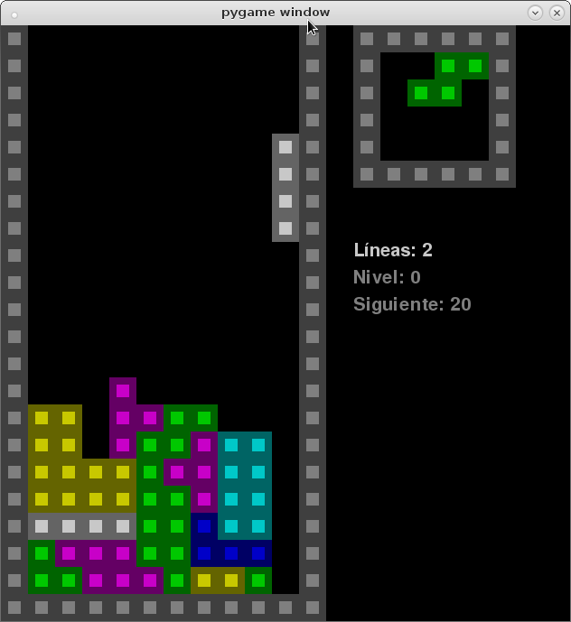

# Cuatris-Python
A small (<378 lines) Tetris clone written in Python and using Pygame.



## Install Python 3.4
Pygame won't work in upper releases, so **install specifically Python 3.4** (currently, minor version is 3.4.4). Check your platform guide browsing [Python website](https://www.python.org).

## Install Pygame
Check your platform guide browsing [Pygame website](http://www.pygame.org/wiki/GettingStarted)

## Run the game
```
$ python3 cuatris.py
```

## Notes
This code was written long ago using IDLE solely for educating (High-School audience) purposes. Tests, project structure and other Software-Engineering related improvements may come in a near future.

In addition, I recently found that Pygame can't render fonts in my Macbook Pro running macOS Sierra and Pygame Window freezes because of that. If you find that under macOS the Pygame window get's freezed, comment out the `pygame.font` usage. Under Debian it runs OK.
