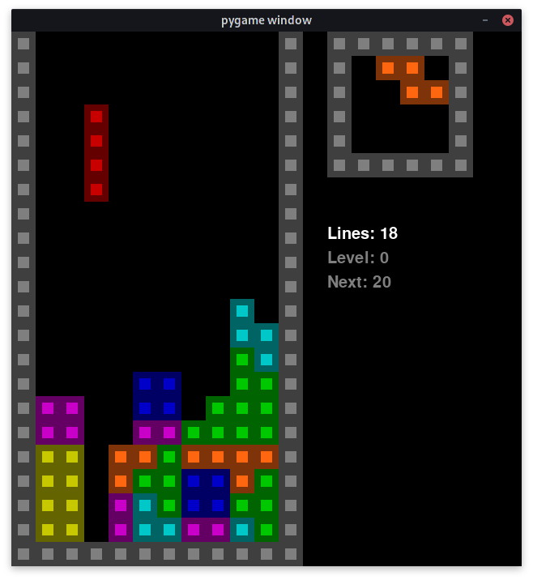

# Cuatris-Python
A small Tetris clone written in Python and using Pygame.



## Install Python 3 and `pipenv`
Install a stable release of Python 3 on your system, and then install `pipenv`. 

It is preferable to install `pipenv` in the user space in order to avoid breaking system-wide packages or Python installations. This applies especially to macOS and GNU/Linux, including Raspberry Pi OS, because they are known to have a lot of system components written in Python.

In the command line, type:
```bash
$ pip install --user pipenv
```

## Clone this Repository and Install Dependencies
After cloning the repository with `git` or downloading as a zip file and uncompressing it, navigate to its folder and type the following in the command line:
```bash
$ pipenv install
```
The right dependencies will install thanks to the files `Pipfile` and `Pipfile.lock`.

## Run the game

```
$ pipenv run python cuatris.py
```

Alternatively you can start an dedicated Python environment and run the game within it. This is useful in case you want to tinker with the code after the game.
```bash
$ pipenv shell
(cuatris-python) $ python cuatris.py
```

## Troubleshooting
### The text doesn't render
Back in 2016, Pygame couldn't render fonts in macOS Sierra, and the Pygame window was freezing as a consequence of that. If you find that, still today, the Pygame window gets frozen under macOS, comment out all `pygame.font` usage. 

Under GNU/Linux it runs OK, and it wasn't tested on macOS upper releases. 

## Known Limitations or Issues
The close window event is not correctly handled. If you close the Pygame window with its title bar's close button, you may have to kill the process manually; this will depend on your Windows Manager or Desktop Environment if you're using GNU/Linux. 

To do that, suspend the game with `CTRL+Z` and kill the process by issuing a `kill -9` to the `PID` that was just printed:

```bash
(cuatris-python) $ python cuatris.py                              
pygame 2.0.1 (SDL 2.0.14, Python 3.9.1)
Hello from the pygame community. https://www.pygame.org/contribute.html
^Z
[1]  + 88494 suspended  python cuatris.py
(cuatris-python) $ kill -9 88494
[1]  + 88494 killed     python cuatris.py  
(cuatris-python) $ 

```

## Note
This code was written in 2016 using IDLE solely for educational purposes. Tests, a more advanced / professional project structure and other Software-Engineering related improvements may, or may not, come in the future.
